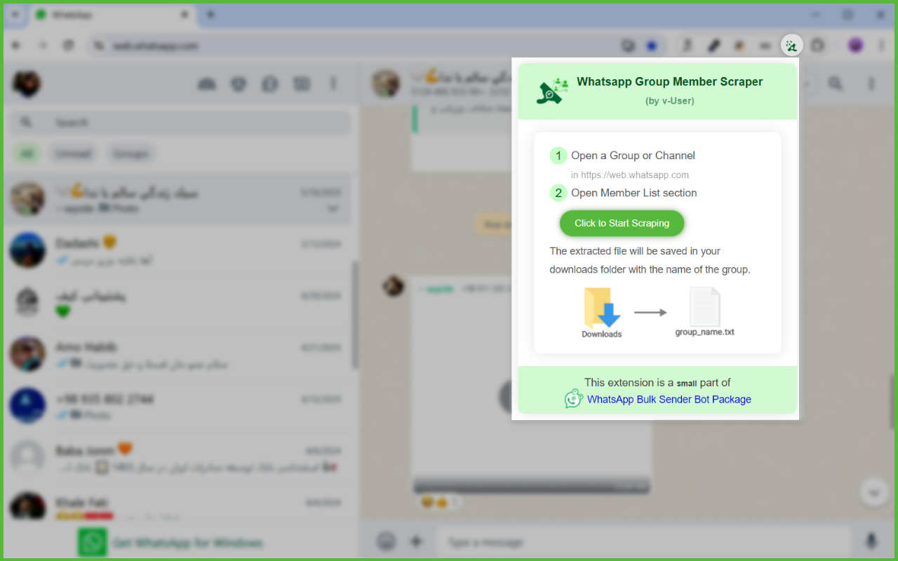

# WhatsApp Group Member Scraper Chrome Extension

## Overview

This Chrome extension scrapes members from a target WhatsApp group. Simply open the group members list, click the scrape button, and the extension will gather names, phone number and bio, saving them in a `.txt` file in your download folder.

### Features
*   **Scrapes WhatsApp group member names, phone number and bio**
*   **Saves data in a `.txt` file**
*   **Easy one-click scraping process**
*   **Provides progress notifications**

### How to Use
1. Install the extension in Chrome.
2. Go to the WhatsApp group you want to scrape.
3. Open the group members list.
4. Click the scrape button in the extension.
5. Wait for the process to finish.
6. Find the data in your download folder.

## Installation
1. Download the extension from [MehDAsaD/whatsapp-group-member-scraper-extension.](https://github.com/MehDAsaD/whatsapp-group-member-scraper-extension/tree/main).
2. Open Chrome and go to "[chrome://extensions/](chrome://extensions/)".
3. Enable "Developer mode".
4. Click "Load unpacked" and select the extension folder.

### Technical Details
- Utilizes JavaScript for web scraping.
- Provides real-time notifications.
- Automatically scrolls to load all group members.
- Saves data as a text file.
  

### Screenshots
1. Click on the WhatsApp Group Member Scraper extension icon to view the user interface in a pop-up. Click the "Click to Start Scraping" button to begin extraction.

   

2. You will see that the group members are being extracted.

   

3. The group member information is automatically saved in the Downloads folder on your system.

   

#WhatsAppScraper #ChromeExtension #DataScraping #WebScraping #JavaScript #WhatsAppGroupScraper #WhatsAppMemberScraper #GroupMemberScraper
